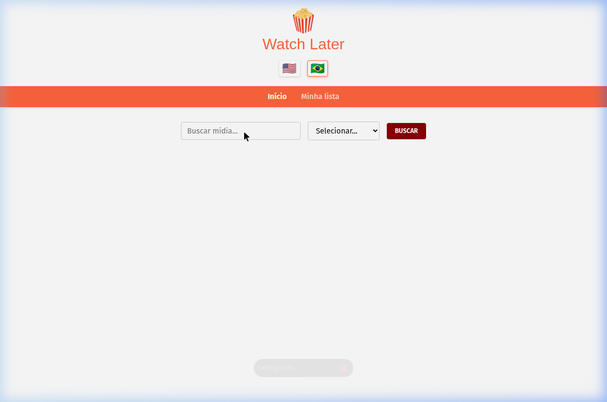
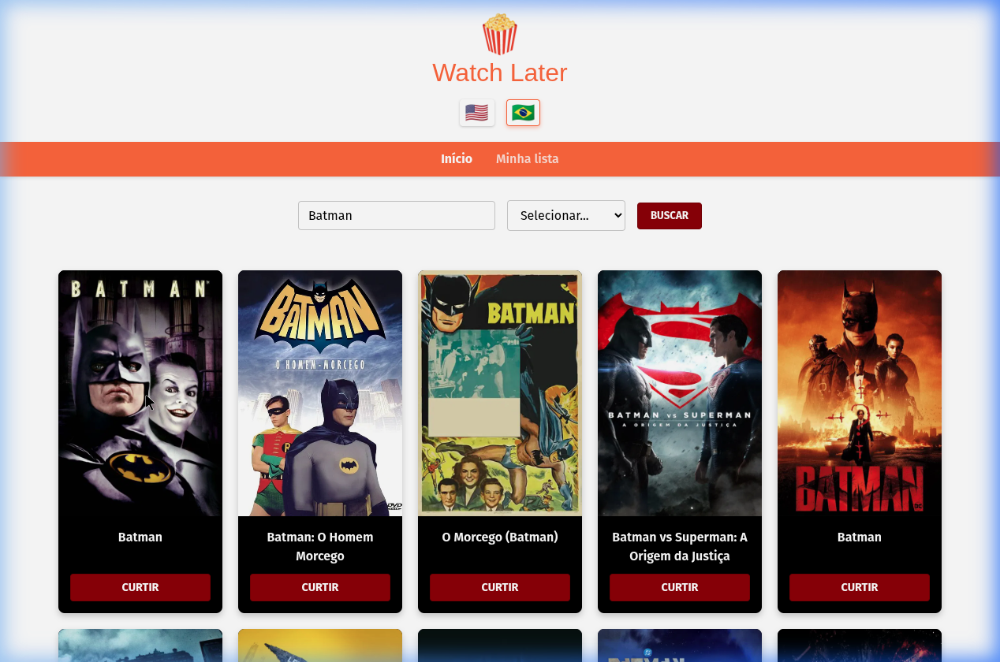
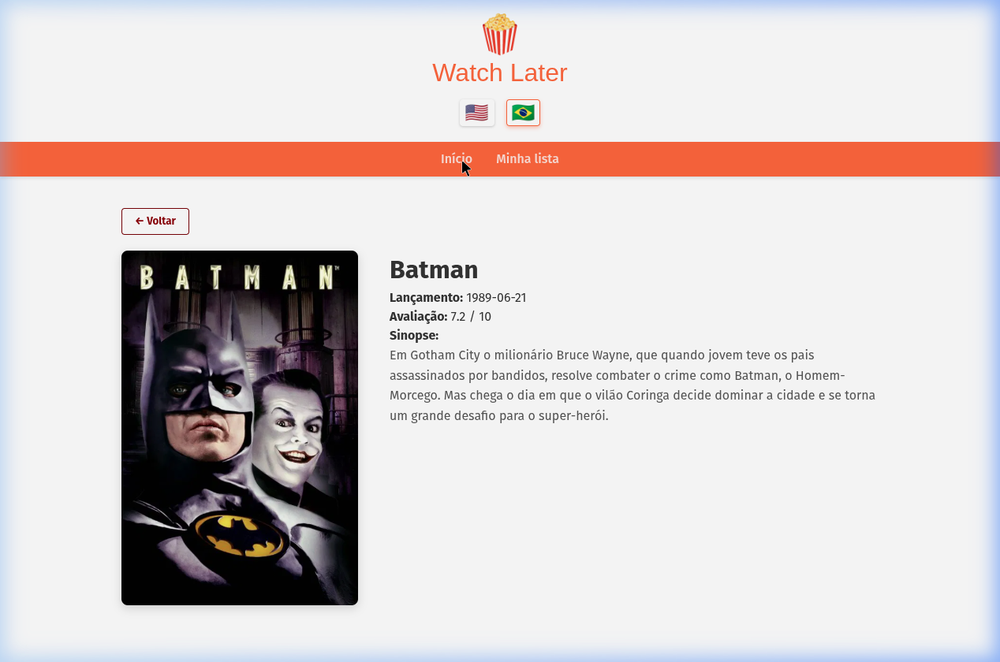
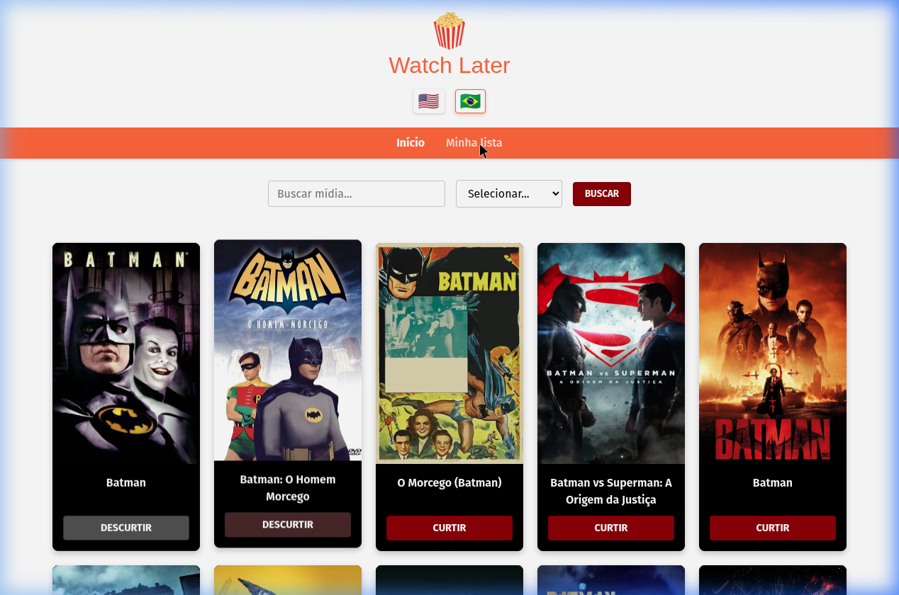

<div align="center">

# 🍿 Watch Later

### Aplicação de busca e gerenciamento de mídias construída com React, Redux e Clean Architecture

[](https://react.dev/)
[](https://www.typescriptlang.org/)
[](https://redux-toolkit.js.org/)
[](https://vite.dev/)
[](https://www.i18next.com/)

</div>

---

## 📸 Screenshots

| Tela inicial | Resultados da busca |
|:---:|:---:|
|  |  |

| Detalhes do filme | Minha Lista |
|:---:|:---:|
|  |  |

---

## ✨ Funcionalidades

- 🔍 **Busca de mídias** — Pesquise Filmes, Séries ou Episódios usando a API do TMDB
- 🌐 **Internacionalização (i18n)** — Suporte completo a Português 🇧🇷 e Inglês 🇺🇸, com re-busca automática dos títulos no idioma selecionado
- ❤️ **Curtir / Descurtir** — Marque mídias como favoritas diretamente nos cards (toggle CURTIR ↔ DESCURTIR)
- 📋 **Minha Lista** — Página dedicada com todas as mídias curtidas, com opção de remover
- 📄 **Página de Detalhes** — Sinopse, avaliação, data de lançamento e pôster ampliado de cada mídia
- 🔒 **Credenciais seguras** — API Key carregada exclusivamente via variável de ambiente (`.env`), nunca exposta no código

---

## 🏗️ Arquitetura

O projeto segue os princípios da **Clean Architecture**, separando responsabilidades em camadas bem definidas:

```
src/
├── ifrastructure/           # Camada de infraestrutura (dados externos)
│   ├── api/
│   │   └── http.ts          # Cliente Axios com interceptor de idioma
│   ├── i18n/
│   │   ├── i18n.ts          # Configuração do i18next
│   │   └── locales/         # Arquivos de tradução PT-BR e EN-US
│   └── movies/
│       ├── movie.types.ts   # Interfaces TypeScript (MediaItem, MediaDetails)
│       └── movies.service.ts # Serviços de busca e detalhes (TMDB API)
│
├── store/                   # Camada de estado global (Redux)
│   ├── index.ts             # Configuração da Store
│   ├── hooks.ts             # Hooks tipados (useAppDispatch, useAppSelector)
│   └── slices/
│       ├── moviesSlice.ts   # Estado de busca + Async Thunk fetchMovies
│       └── myListSlice.ts   # Estado da lista de favoritos
│
└── presentation/            # Camada de apresentação (UI)
    ├── shared/
    │   ├── button/          # Componente Button reutilizável
    │   └── header/          # Header com logo, idioma e navegação
    └── views/
        ├── home/            # Página de busca (SearchBar + MovieGrid + MovieCard)
        ├── movie-detail/    # Página de detalhes da mídia
        └── my-list/         # Página de favoritos
```

---

## 🚀 Tecnologias

| Tecnologia | Versão | Uso |
|---|---|---|
| **React** | 19 | Framework de UI com componentes funcionais e hooks |
| **TypeScript** | 5 | Tipagem estática em todo o projeto |
| **Redux Toolkit** | 2 | Gerenciamento de estado global com Slices e Async Thunks |
| **React Redux** | 9 | Integração do Redux com React via Provider e hooks |
| **React Router DOM** | 7 | Roteamento entre páginas (Home, Detalhes, Minha Lista) |
| **i18next + react-i18next** | 26/17 | Internacionalização dinâmica PT-BR ↔ EN-US |
| **Axios** | 1 | Cliente HTTP com interceptor para idioma dinâmico |
| **Vite** | 8 | Bundler e servidor de desenvolvimento |
| **TMDB API** | v3 | Fonte dos dados de filmes, séries e episódios |

---

## ⚙️ Como rodar localmente

### Pré-requisitos

- Node.js 18+
- Yarn
- Conta no [The Movie Database (TMDB)](https://www.themoviedb.org/) para obter uma API Key

### Instalação

```bash
# Clone o repositório
git clone git@github.com:LeonardoJaques/react-clean-architecture.git
cd react-clean-architecture

# Instale as dependências
yarn install

# Configure as variáveis de ambiente
cp .env.example .env
# Edite o .env e adicione sua VITE_MOVIES_API_KEY
```

### Executar

```bash
# Modo desenvolvimento (com HMR)
yarn dev

# Build de produção
yarn build

# Preview do build
yarn preview
```

A aplicação estará disponível em `http://localhost:5173`

---

## 🔐 Variáveis de Ambiente

Crie um arquivo `.env` na raiz do projeto baseado no `.env.example`:

```env
VITE_MOVIES_API_KEY=seu_token_aqui
```

> **⚠️ Importante:** Nunca commite o arquivo `.env` com suas credenciais. Ele já está configurado no `.gitignore`.

Para obter a API Key do TMDB:
1. Crie uma conta em [themoviedb.org](https://www.themoviedb.org/)
2. Acesse **Configurações → API**
3. Copie o **Bearer Token (API Read Access Token)**

---

## 📄 Licença

Este projeto foi desenvolvido como projeto acadêmico para a PUC Minas.
